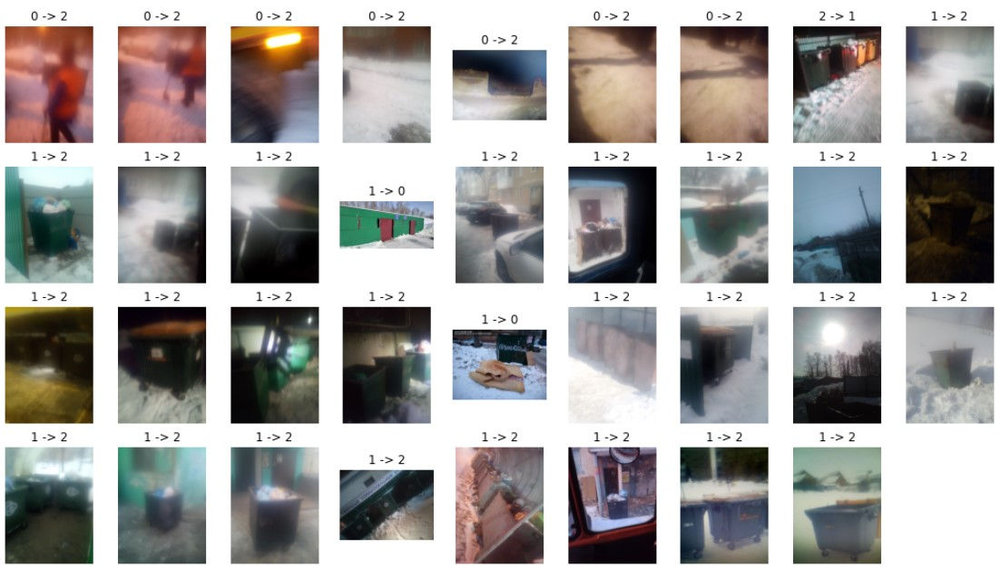

# Задача &laquo;Оптимизация работы коммунальных служб&raquo;

### Условие задачи
В рамках чемпионата вам необходимо создать и обучить модель машинного зрения, которая поможет на основе выявления аномалий на представленных фотоснимках формировать фокусированные проблемно-ориентированные выборки, что в свою очередь позволит продуктивно организовать работу инспекторов.

Качество снимков имеет три категории:
- неудовлетворительного качества;
- с отсутствующими мусорными баками;
- соответствующие всем необходимым условиям.

В рамках решения задачи была проведена реклассификация изображений, чтобы снизить шумность разметки, изображения были размещены в 3 подкаталога (по номерам классов): 0, 1, 2.

## Обучение

За основу была взята предобученная модель *swin_large_patch4_window12_384* из пакета *timm*. Обучение происходило с использованием кросс-валидации, использовалось 7 фолдов.

Для предсказания берется лучшие 5 моделей.
